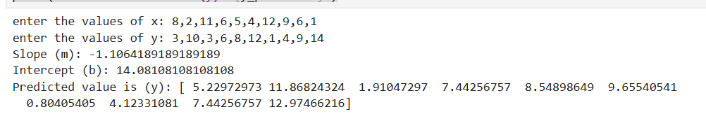

# Implementation of Univariate Linear Regression
## AIM:
To implement univariate Linear Regression to fit a straight line using least squares.

## Equipments Required:
1. Hardware – PCs
2. Anaconda – Python 3.7 Installation / Jupyter notebook

## Algorithm
1. Get the independent variable X and dependent variable Y.
2. Calculate the mean of the X -values and the mean of the Y -values.
3. Find the slope m of the line of best fit using the formula. 

4. Compute the y -intercept of the line by using the formula:

5. Use the slope m and the y -intercept to form the equation of the line.
6. Obtain the straight line equation Y=mX+b and plot the scatterplot.

## Program:
```

Program to implement univariate Linear Regression to fit a straight line using least squares.
Developed by: SARANYA S.
RegisterNumber: 212223220101


import numpy as np
import matplotlib.pyplot as plt
x=np.array(eval(input("enter the values of x:")))
y=np.array(eval(input("enter the values of y:")))
mean_x = np.mean(x)
mean_y = np.mean(y)
num = 0
denum = 0
for i in range(len(x)):
    num+=(x[i]-mean_x)*(y[i]-mean_y)
    denum+=(x[i]-mean_x)**2
#slope
m=num/denum
#intercept y
b=mean_y - m*mean_x

print(f"Slope (m): {m}")
print(f"Intercept (b): {b}")
y_predicted = m*x+b
print(f"Predicted value is (y): {y_predicted}")

```

## Output:



## Result:
Thus the univariate Linear Regression was implemented to fit a straight line using least squares using python programming.
